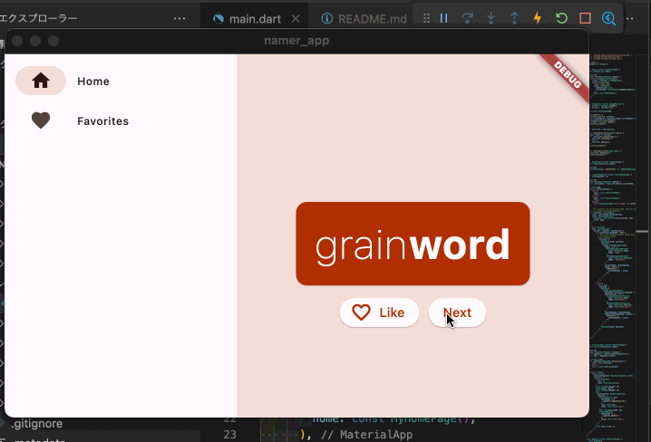

# namer_app

## See

- <https://codelabs.developers.google.com/codelabs/flutter-codelab-first#0>
  初めての Flutter アプリ

- <https://www.youtube.com/watch?v=8sAyPDLorek&t=2s>
  Building your first Flutter App - with a Codelab!

- <https://github.com/flutter/codelabs/tree/main/namer>
  codes in githu

- <https://dartpad.dev/?id=e7076b40fb17a0fa899f9f7a154a02e8>
  高度な最終的なコード
